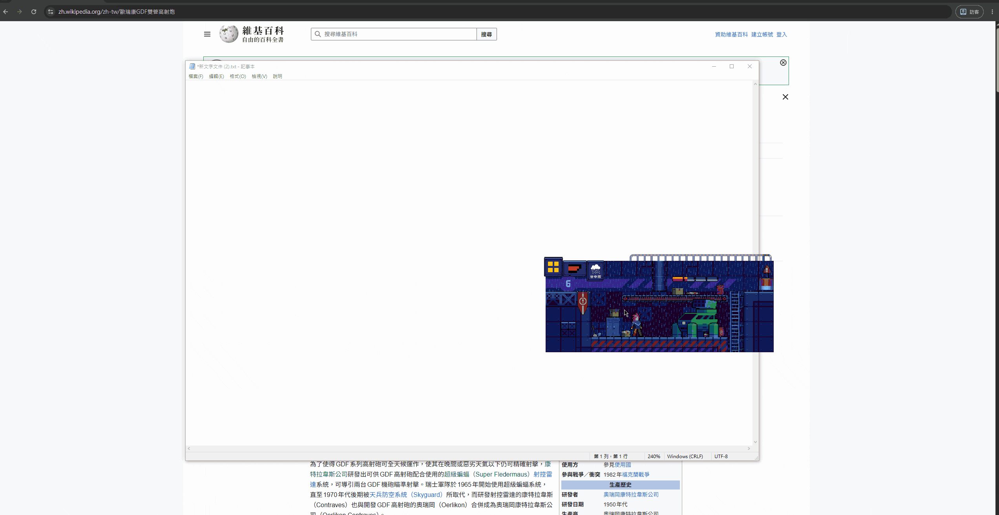
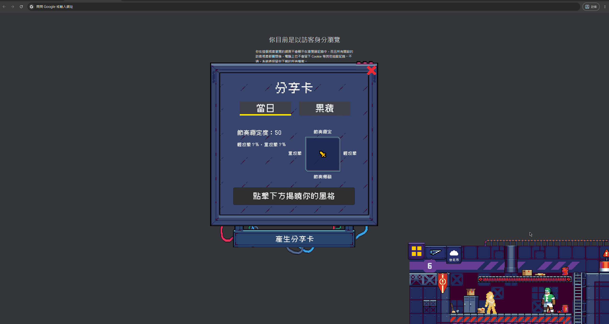
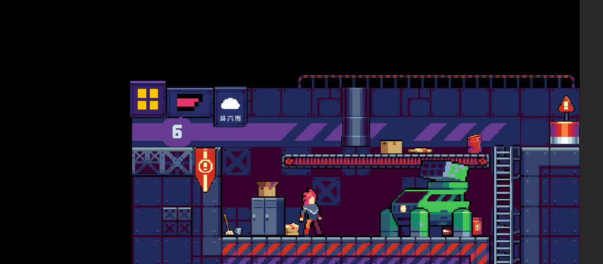
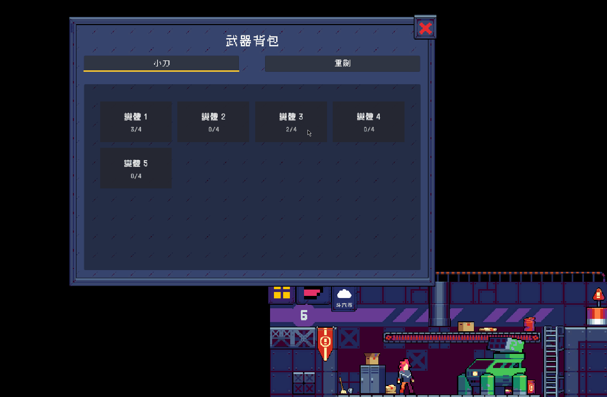
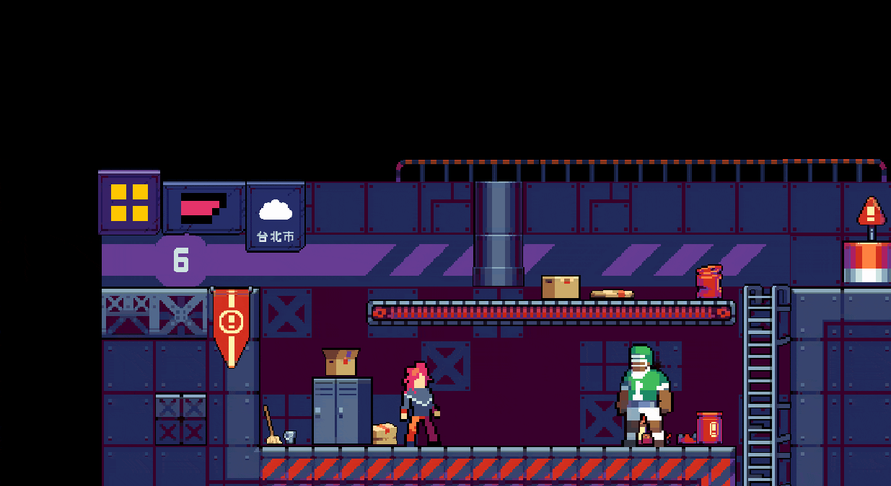
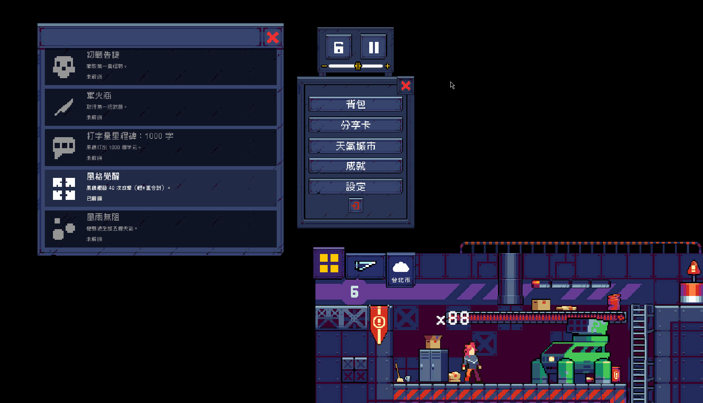

### 🎮 [點此在 itch.io 免費下載遊玩](https://yama-kin.itch.io/deskslayer)

# DeskSlayer

> 你打字，它就打怪——一款桌面陪伴型打字戰鬥遊戲

<table>
<tr>
<td width="50%"></td>
<td width="50%"></td>
</tr>
</table>

## 這是什麼

DeskSlayer 會疊加在你的桌面上，用完全透明的視窗跟著你工作。你平常打字的每一下按鍵，就是你的攻擊指令——不需要額外操作，一邊工作、一邊讓角色在桌面上默默跟怪物戰鬥。

## 核心玩法

- 打字即攻擊，全域鍵盤監聽，不需要切換視窗焦點
- 雙武器風格對比：小刀（敏捷、輕攻擊）與重劍（蓄力、重攻擊）
- 武器收集與合成系統：擊敗敵人掉落武器與碎片，合成強化、碎片兌換
- 打字風格分析：依按鍵節奏與輕重攻擊傾向，分析專屬戰鬥風格
- 天氣連動戰鬥系統：串接真實天氣資料，影響戰鬥數值
- 每日戰報分享卡：以真實桌面截圖為背景生成分享圖卡
- 成就系統：記錄打字量與戰鬥歷程里程碑

<b>▶ 完整玩法展示</b>

 

<table>
<tr>
<td width="50%"> 打字即攻擊，可拖曳至桌面任意位置</td>
<td width="50%"> 小刀輕攻擊 vs 重劍蓄力重攻擊</td>
</tr>
<tr>
<td width="50%"> 武器與碎片掉落、合成強化</td>
<td width="50%"> 風格分析與每日戰報分享卡生成</td>
</tr>
<tr>
<td width="50%"> 真實天氣資料影響戰鬥數值</td>
<td width="50%"> 打字量與戰鬥歷程成就</td>
</tr>
</table>

## 技術亮點

| 技術點 | 說明 |
|---|---|
| **ScriptableObject 資料驅動架構** | 全專案資料層一致採用，武器/敵人/成就/風格主題皆為 SO 驅動，新增內容規範有條理 |
| **介面化與解耦設計** | `ICombatResolver` 介面化戰鬥判定、`CombatDispatcher` Mediator 解耦輸入與敵人系統、`AttackInputAggregator` 統一鍵盤/滑鼠輸入來源 → [完整決策文件](docs/decisions/0001-decoupled-input-architecture.md) |
| **桌面透明視窗整合** | Spike 分支驗證手刻 Win32 方案，正式階段評估後改用 UniWindowController → [完整決策文件](docs/decisions/0002-desktop-overlay-integration.md) |
| **CPU 效能優化** | 反射停用第三方套件內部無條件執行的協程，CPU 佔用降低約 10 倍 → [完整決策文件](docs/decisions/0003-cpu-performance-optimization.md) |
| **存檔系統設計** | 依資料性質分流 PlayerPrefs 與自訂 JSON，具備版本相容機制 → [完整決策文件](docs/decisions/0004-save-load-format.md) |
| **天氣 API 整合** | 選用 OpenWeatherMap，含金鑰管理、離線容錯、快取節流 → [完整決策文件](docs/decisions/0005-weather-api-integration.md) |
| **PlayStyleProfile 演算法迭代** | 採 Welford's Online Algorithm，以定量記憶體捕捉完整 session 歷史 → [完整決策文件](docs/decisions/0006-playstyle-algorithm.md) |

<b>▶ 更多技術決策</b>

 

- [成就系統：單向訂閱架構下的零修改擴充](docs/decisions/0007-achievement-system.md)
- [武器收集與合成系統](docs/decisions/0008-weapon-collection-system.md)
- [Shader Graph 轉手寫 HLSL 的技術路線調整](docs/decisions/0009-shader-approach-change.md)
- [Git 版控實務](docs/decisions/0010-git-workflow.md)
- [敏捷精神實踐：單人開發下的時間盒與迭代增量](docs/decisions/0011-agile-in-solo-dev.md)
- [排行榜功能評估與捨棄](docs/decisions/0012-leaderboard-evaluation.md)
- [測試與除錯工具設計原則](docs/decisions/0013-testing-tools.md)

## 開發方式

開發過程採用 Claude Code 負責依規格實作並透過 Unity MCP 操作 Editor 的協作模式。版控採 feature branch + PR 流程、Conventional Commits，並依任務性質判斷 Git Worktree 的使用時機。

## Credits

本作品使用以下第三方資源，特此致謝：

### 字體

- **Cubic 11（俐方體11號）** by ACh-K — [GitHub](https://github.com/ACh-K/Cubic-11) — 授權：SIL Open Font License 1.1

### 美術素材

- **Free Characters with Melee Attack (Pixel Art)** by CraftPix — [連結](https://free-game-assets.itch.io/free-characters-with-melee-attack-pixel-art)
- **Free Bosses Pixel Art Sprite Sheet Pack** by CraftPix — [連結](https://free-game-assets.itch.io/free-bosses-pixel-art-sprite-sheet-pack)
- **Weather Effects Assets Pack (Pixel Art)** by CraftPix — [連結](https://free-game-assets.itch.io/weather-effects-assets-pack-pixel-art)

以上素材依 [CraftPix 免費素材授權條款](https://craftpix.net/file-licenses/) 使用。

### 音效與音樂

- **Brackeys Platformer Bundle**（音效、音樂）
  原始素材製作者：analogStudios_、RottingPixels｜重新包裝與修改：Brackeys
  音效：Brackeys、Asbjørn Thirslund｜音樂：Brackeys、Sofia Thirslund
  授權：Creative Commons Zero (CC0)

## License

保留所有權利（All Rights Reserved）。本專案原始碼僅供展示與檢閱，不授權他人使用、修改或散布。第三方資源授權詳見上方 Credits。

---

🎮 [在 itch.io 下載遊玩](https://yama-kin.itch.io/deskslayer)
